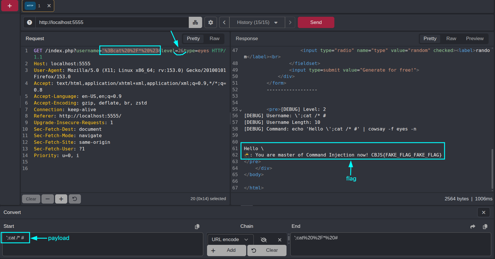

# Behaviour:

* Đã thử 1 vài payload và nhận thấy là nếu payload quá dài sẽ bị cắt đi khúc sau, chỉ nhận 10 ký tự thôi

→ Vì vậy thay gì payload như level 1 là: `'; cat /se* #` sẽ đổi lại thành `';cat /* #`

* Có 2 lý do vì sao lại làm vậy:
  * Tránh bị cắt ký tự
  * Ở root dù sao cũng chỉ có 1 file duy nhất đó là flag, kiến trúc của linux (docker) thường sẽ là 100% dir

