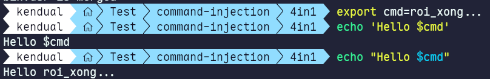
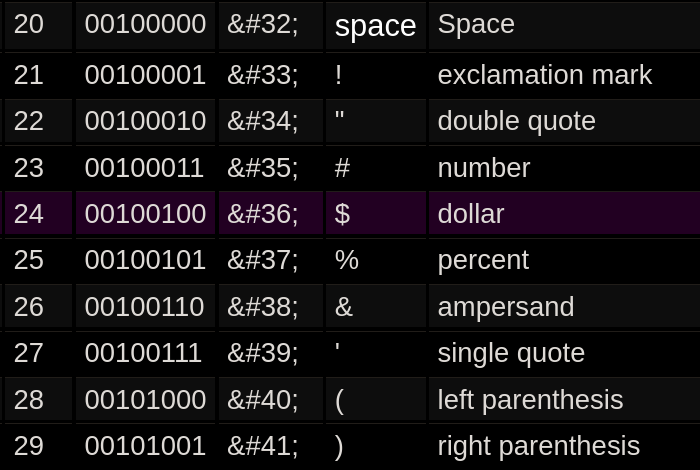
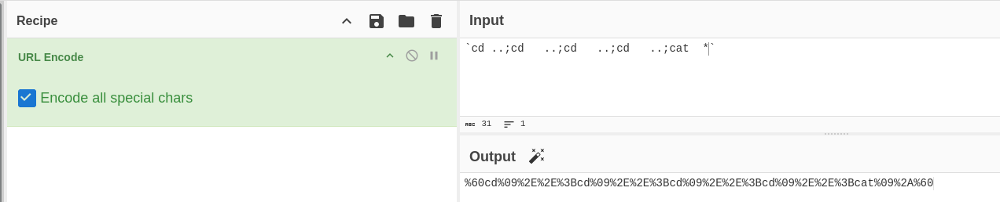

* Phát hiện vấn đề khi đọc code black box đó là ở `type=figlet` dev đã dùng dấu double thay vì single quote ở đoạn cuối.

```bash
echo 'Hello $username' | cowsay -n ; figlet "Hello $username" <-- chỗ này dính chưởng
```

* Tại sao ở đây dính command injection:
  * Vì trong Unix command dấu double quote có thể thực thi được lệnh còn single quote thì không:
  * PoC:



# Build payload:

* Chí mạng ở chỗ là regex đã chặn hầu hết các ký tự cần thiết để đọc secret_file ở root đó là (và dấu slash `/`):



Nhưng vẫn chưa lọc kỹ vì vẫn còn ký tự chưa được lọc trong command injection đó là dấu `` ` ``, từ đó em có thể dùng các sự thay thế như sau:



* `<space>` → `<tab>`
* dùng command substitution: ``` `` ```

